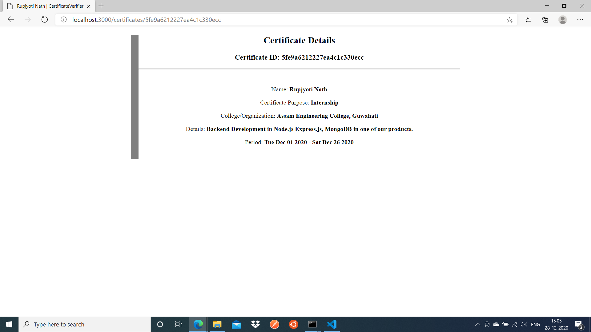

# CertificateVerifier
App to issue & verify internship certificate. A pdf copy gets emailed to the intern.

**This project handles the creation & verification of certificates while a separate microservice handles the actual pdf creation & emailing of it. Both are connected using an Amazon SQS Message Queue. Visit the [CertificateVerifier-PDF-Email](https://github.com/rupjyotinath/CertificateVerifier-PDF-Email) project for the source code & description of the other service.**

Note that even if the pdf & email part is handled by a different microservice as mentioned above , however for explanation of the project, the application as a whole might be mentioned.

Pdf copy doesn't get stored anywhere in the disk. It's because it's not needed. A stream is generated & passed to nodemailer directly to email it.

Here is a certificate that has been generated & emailed,

A pdf copy is included in "sample-certificate" folder.


Here are the intermediate steps followed while generating the above certificate. (By this microservice)


Note: The email field of intern is not seen above because for testing purpose, a fixed email was used. However it has been changed before commiting the code to GitHub.


The screenshots of the part handled by the pdf-email microservice.


The completely downloaded copy of this is shown in the first screenshot.

Other screenshots of this "CertificateVerifier" microservice, (without signing in)

The verification cum homepage,


Verification of a certificate



## Why two Microservices using Queue?

* **Separation of task**- Certificate issue & verify doesn't need to know how the actual pdf copy looks like or what email provider is used.
* **Better error handling & faster response**- The pdf generation & email takes significantly larger time. Using a async function could have helped but what if anything goes wrong ? Retry mechanism ? Using a Message Queue helps significantly. Put it in the queue successfully, return the response & then even if the pdf-email service is down, you would have the newly issued certificates in the Queue for many days (I have configured 10 days, which is a lot), until its properly processed i.e. pdf generated & emailed.

## Getting Started

### Installation & Setup
Clone or fork this repository.
Make sure to have Node.js & npm installed.

Note: The pdf-email microservice usage instructions are provided in that project independently.

After navigating to the project directory,
```bash
npm install
```
to install the dependencies.

You need to have a MongoDB database setup. I have used MongoDB Atlas.

Create an Amazon SQS Queue (Amazon provides 12 months free tier). Standard queue would be just fine. Additionally, set up a dead-letter queue.

The following environment variables are required:
* DB_CONNECTION_STRING: The database conenction string
* SESSION_SECRET: for express-session
* AWS_ACCESS_KEY_ID: AWS Key ID you will receive when creating an user
* AWS_SECRET_ACCESS_KEY: The AWS secret key you will get along with the Key ID.
* AWS_SQS_QUEUE_URL: The SQS URL you will obtain after creating an SQS Queue.

Rename the .envsample file to .env during development & put the values of the above environment variables.

### Running
Run the app using 
```bash
node ./src
```
or
```bash
node ./src/index.js
```

You can also set up an npm command in package.json file.


### Usage

An user needs to created before creating any certificate.

Visit localhost:3000/register to add an user. Only one user is allowed.

Login in localhost:3000/login route.

Only the created user can issue & edit certificates.
Anyone can verify a certificate, provided a valid Certificate ID.

As mentioned, this microservice is responsible only for generating & verifying certificates. The pdf creation & emailing is handled by a different one. So, the other project needs to be configured to generate a pdf & send emails.

## Notes/Improvements
* Can be quickly modified to issue other kind of certificates , example- workshop or attending a webinar, etc.
* Can be modified to have multiple users & admin.

## LICENSE
MIT

(c) 2020 Rupjyoti Nath